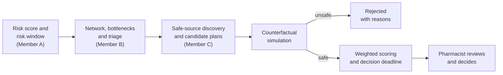
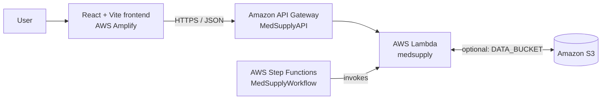

# MedSupply

**A medicine supply-chain decision-support platform that turns shortage-risk warnings into safe, simulated, deadline-aware sourcing options for a human pharmacist to review.**

| | |
|---|---|
| **Live demo** | <https://main.d31fsbjqraajjf.amplifyapp.com> |
| **API base URL** | <https://ir06s4arb0.execute-api.ap-southeast-2.amazonaws.com> (paths start with `/api`) |
| **GitHub** | <https://github.com/DHIKSHITHA0906/MedSupply> |
| **AWS region** | `ap-southeast-2` |

> **Decision support only.** MedSupply does not diagnose, prescribe, or recommend clinical substitutions. Every plan it produces requires human (pharmacist) review. See [Responsible use](#responsible-use).

---

## Problem

Medicine shortages are usually discovered late, when a hospital is already running low. By then the "obvious" fix (borrow stock from the nearest or cheapest source) can quietly create a *second* shortage somewhere else, and nobody is told how much time they actually have to act.

## Why shortages are a network problem

A medicine is not held in one place. It flows from manufacturers through warehouses to hospitals, and the same manufacturer often makes several medicines. That means:

- moving stock out of one hospital can push **that hospital** below its own safe level;
- squeezing one manufacturer can raise the risk of **its other medicines**;
- a plan that looks cheapest or fastest on paper can be unsafe once the whole network is considered.

Judging a response therefore means judging its effect on the network, not just on the requesting hospital.

## Solution

MedSupply chains three stages into one workflow:

1. **Risk model (Member A):** scores 40 medicines for shortage risk and assigns a risk window.
2. **Supply-network graph and triage (Member B):** links medicines, manufacturers, warehouses and hospitals, finds supplier bottlenecks, and ranks medicines by harm-weighted priority.
3. **Sourcing and simulation (Member C):** for each at-risk medicine, finds sources that can give stock without harming themselves, generates candidate plans, **simulates each plan on a copy of the network**, rejects unsafe ones, scores the safe ones, and computes the latest date to act.

A React console shows the triage queue, the affected network, the accepted and rejected plans, and the decision deadline. The final procurement decision stays with a person.

## Core features (implemented)

| Feature | What it does |
|---|---|
| Shortage-risk scoring | Risk score and risk window for 40 medicines from Member A's saved model and outputs. |
| Harm-weighted triage | Ranked priority (CRITICAL / HIGH / MEDIUM) from Member B's explicit-weight triage score. |
| Safe-source discovery | A source is safe only if `stock − safety stock − forecast demand over 14 days > 0` (suppliers: headroom below a stress line). |
| Candidate generation | Up to 8 plans per medicine: unfiltered baselines (cheapest / fastest / largest) plus safe-source plans. |
| Counterfactual simulation | Copies the network, applies a plan, projects each affected node day by day, compares before vs after, and checks sibling-medicine ripple. Verdict: `ACCEPTED`, `REJECTED` or `PARTIAL_SAFE`. |
| Weighted scoring | Scores **only accepted plans** on cost, network risk, lead time and expiry waste with fixed, disclosed weights. |
| Decision deadline | `latest action = predicted stockout − lead time − intervention time`, with status `OK` / `URGENT` / `ACT_NOW` / `OVERDUE`. |
| Live intervention simulation | POST /api/simulate evaluates the selected sourcing allocation before confirmation.  |
| Decision console | React UI: login gate, KPI strip, triage queue, medicine detail, network view, intervention comparison, confirm step. |

## End-to-end workflow



## Architecture (high level)



The interactive API computes its responses inside Lambda. Step Functions is a separate refresh path that runs prediction and the pipeline and publishes JSON to S3. Details: [docs/ARCHITECTURE.md](docs/ARCHITECTURE.md).

## Worked example: Bupivacaine Hydrochloride Injection

Figures below come from the committed data and the current code (inventory is **simulated**, and generation is seeded and reproducible).

| Step | Result |
|---|---|
| Risk (Member A) | 0.8876 (88.76%), risk window 7 days |
| Triage (Member B) | Rank 1, score 0.955, `CRITICAL` |
| Scenario | Requesting hospital has 257 units (≈4.4 days of cover) and needs **856 units** |
| Deadline | Predicted stockout in 3.83 days; best plan needs 2 days lead + 1 day intervention, so **latest action in 0.83 days (`ACT_NOW`)** |
| Candidates | 5 evaluated: 1 rejected, 4 accepted |
| Rejected | *Cheapest-first*: 856 units from Valley Children's Hospital, which would create a **new shortage at that hospital** |
| Excluded source | McKesson warehouse: `1584 − 408 − 1655 = −479`, nothing safe to give |
| Selected | 856 units from Cencora Regional Hub, ₹45,922.08, 2-day lead, network risk 0.4182 |

A user-proposed 800-unit transfer from Apex Health System is also rejected by `POST /api/simulate` (new shortage at Apex; covers only 94%). Full walkthrough: [docs/DEMO.md](docs/DEMO.md).

## Real vs simulated data

| Category | Data | Origin |
|---|---|---|
| **Source-derived** (Member A) | Drug identities, risk score, risk window, `current_shortage` flag, daily-demand baseline | Member A's dataset and saved model. The model code notes its training data is *partly synthetic* inventory/demand, so treat these as model/dataset-derived, not measured hospital data. |
| **Synthetic** (Member B) | Manufacturer-warehouse-hospital topology, harm/urgency/vulnerability triage parameters | Generated simulation. Manufacturer *names* appear in the graph, but the links and capacities are synthetic. |
| **Simulated** (Member C) | Per-node stock, safety stock, lead time, unit price, expiry, requester and need | Seeded generator (`SEED = 42`), reproducible. No public per-hospital inventory exists. |

Every scenario response carries a `provenance` block, and the UI shows the same distinction. Details: [backend/README.md](backend/README.md#real-vs-simulated-data).

## Technology stack

| Layer | Technology |
|---|---|
| Frontend | React 18, Vite 5, plain CSS |
| Backend | Python 3.12, Flask (local), AWS Lambda handler (deployed) |
| Risk model | scikit-learn RandomForest bundle (`integrated_risk_model.pkl`), loaded with joblib |
| Cloud | Amazon API Gateway, AWS Lambda, Amazon S3, AWS Step Functions, AWS Amplify |
| Deployment assets | Bash build script, SAM/CloudFormation templates, Dockerfile, ASL state machine |

## Current deployment

| Component | Value |
|---|---|
| Frontend | AWS Amplify, <https://main.d31fsbjqraajjf.amplifyapp.com> |
| API | Amazon API Gateway `MedSupplyAPI`, region `ap-southeast-2` |
| Compute | AWS Lambda function `medsupply` (lite package) |
| Workflow | AWS Step Functions state machine `MedSupplyWorkflow` |
| Storage | Amazon S3 (inputs and published results, used when `DATA_BUCKET` is set) |

**Prediction behavior.** The lite package does not bundle scikit-learn or the model file. In that deployment `/api/predict*` serve Member A's precomputed output and say so with `"source": "precomputed_member_a_output"`. Where scikit-learn and the model file are available (local machine or the container-image deployment path), the same endpoints run the saved model live and report `"source": "live_model"`. Check `GET /api/health` to see which mode a given deployment is in. See [docs/DEPLOYMENT.md](docs/DEPLOYMENT.md).

## Repository structure

```text
MedSupply/
├── README.md
├── docs/                 # ARCHITECTURE, API, DEPLOYMENT, TEAM, DEMO
├── backend/
│   ├── medsupply_member_c/   # pipeline, simulator, optimizer, deadline, predict, api_core
│   ├── data/                 # Member A/B outputs, demand baseline, latest features
│   ├── model/                # integrated_risk_model.pkl (Member A)
│   ├── deploy/               # build script, SAM templates, Dockerfile, state machine
│   ├── medsupply_lite/       # committed copy of the lite package contents
│   ├── app.py                # local Flask API
│   ├── lambda_handler.py     # AWS Lambda entry point
│   ├── main.py               # regenerates member_c_output.json
│   └── test_*.py             # test scripts
└── frontend/                 # React + Vite console
    └── src/{components,services,lib,data,styles}
```

## Local setup (overview)

```bash
# Backend (Python 3.12)
cd backend
pip install -r requirements.txt                      # Flask
pip install numpy scipy joblib scikit-learn==1.8.0   # optional: live model scoring
python app.py                                        # API on http://localhost:5000

# Frontend (Node 18+)
cd frontend
npm install
echo "VITE_API_BASE_URL=http://localhost:5000" > .env   # or copy .env.example
npm run dev
```

Full instructions: [backend/README.md](backend/README.md) and [frontend/README.md](frontend/README.md).

## Documentation

| Document | Contents |
|---|---|
| [backend/README.md](backend/README.md) | Pipeline, scoring, deadline, data, model, tests, local run |
| [frontend/README.md](frontend/README.md) | UI structure, API integration, configuration, build |
| [docs/ARCHITECTURE.md](docs/ARCHITECTURE.md) | System design, data flow, AWS roles, real/simulated boundaries |
| [docs/API.md](docs/API.md) | Every endpoint with examples and error behavior |
| [docs/DEPLOYMENT.md](docs/DEPLOYMENT.md) | AWS resources, lite package, build and deploy flow |
| [docs/DEMO.md](docs/DEMO.md) | Step-by-step demo script |
| [docs/TEAM.md](docs/TEAM.md) | Team roles and contributions |

## Team

| Member | Role |
|---|---|
| **KatirVelavan**, Member A | Data & Risk Model; demo video |
| **R. Shreya**, Member B | Graph, Cause & Triage; final project report |
| **Akshaya M V**, Member C | Sourcing & Simulation; frontend refinement |
| **DHIKSHITHA R G**, Member D | System Integration & AWS Deployment; documentation |

Details: [docs/TEAM.md](docs/TEAM.md).

## Limitations

- **Not production-ready.** This is a college / competition project. The API has no authentication and allows any origin (`*`).
- **Inventory and network data are simulated or synthetic.** Results demonstrate the method, not real hospital stock. One hospital per scenario is a deliberately seeded "tempting but unsafe" decoy, so the rejection of unsafe plans is partly by construction.
- **The frontend login is a demo gate** with client-side credentials. It is not a security boundary.
- **"Confirm selected plan" is UI-only.** It changes local screen state; nothing is saved or ordered.
- **Scoring is a fixed-weight heuristic**, not a mathematical optimizer, and the simulator is a deterministic projection, not a learned model.
- **`/api/predict` what-if is an experimental sensitivity probe**, not a causal simulation (see [docs/API.md](docs/API.md)).
- **`current_shortage` differs by prediction source.** In precomputed mode it is Member A's stored flag; in live-model mode the API derives it as `risk ≥ 0.37`, which flags many more medicines. See [docs/API.md](docs/API.md#note-on-current_shortage).
- Several Member A/B analytics (substitution candidates, common-cause and timing-cascade findings, hospital exposure, warehouse strain) exist in the data files but are **not surfaced** by the API or UI.

## Future improvements

*Ideas only, not implemented.*

- Persist and audit review decisions (a real sign-off record).
- Replace the demo login with managed authentication and restrict CORS.
- Replace simulated inventory with real hospital and warehouse feeds.
- Surface Member B's cause and cascade analysis in the UI.
- Add automated CI (tests, frontend build) and a scheduled Step Functions run.

## Responsible use

MedSupply is a **decision-support prototype**. It highlights supply risk and compares sourcing options; it does **not** provide clinical prescribing, diagnosis, patient-specific treatment, or clinical substitution advice. Candidate substitution relationships in the data are non-clinical links that require clinical verification. Outputs depend on simulated and synthetic inputs and must be reviewed by a qualified pharmacist before any procurement action.
