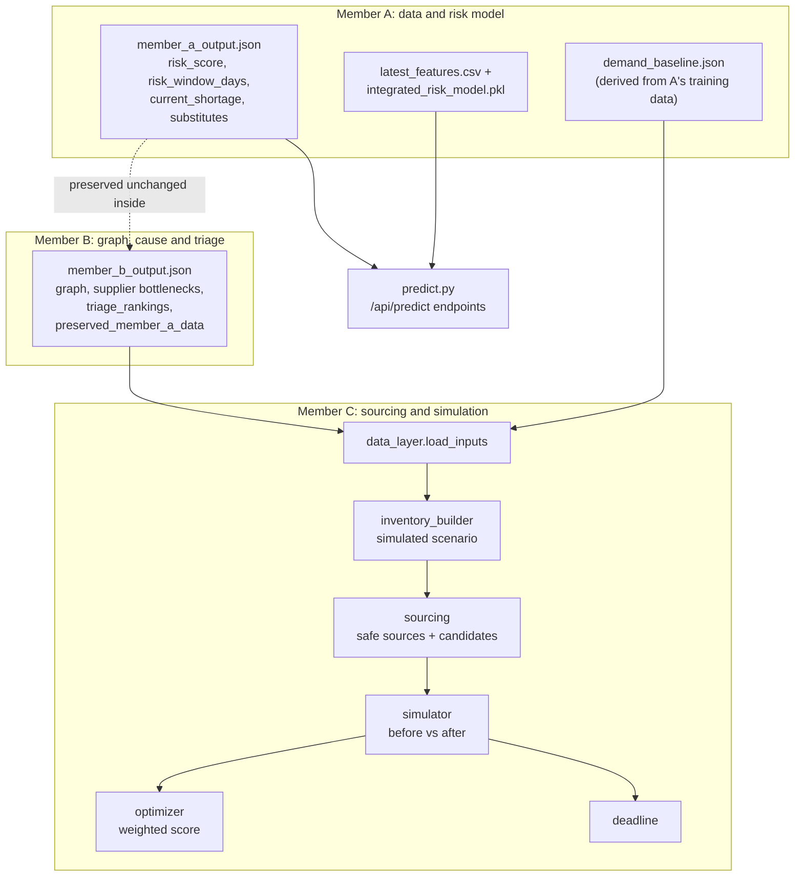

# MedSupply Backend

Python backend for MedSupply: consumes the risk model output (Member A) and the supply-network/triage output (Member B), then runs **safe sourcing → counterfactual simulation → weighted scoring → decision deadline** (Member C) for every at-risk medicine, and serves the results as a JSON API.

The same code runs locally (Flask) and on AWS (Lambda behind API Gateway). For the wider picture see the [root README](../README.md), [docs/ARCHITECTURE.md](../docs/ARCHITECTURE.md), [docs/API.md](../docs/API.md) and [docs/DEPLOYMENT.md](../docs/DEPLOYMENT.md).

> **Naming note.** The Python package is called `medsupply_member_c` for historical reasons, but it holds the whole backend: the Member C pipeline **and** the shared API layer (`api_core.py`), prediction (`predict.py`) and S3 helpers (`storage.py`) used by both Flask and Lambda.

> **Decision support only.** Nothing here provides clinical prescribing, diagnosis or substitution advice. Every plan requires human (pharmacist) review.

---

## Responsibilities

| Responsibility | Where |
|---|---|
| Load Member A + B outputs into one lookup | `medsupply_member_c/data_layer.py` |
| Build a simulated inventory scenario per medicine | `medsupply_member_c/inventory_builder.py` |
| Classify safe sources, generate candidate plans | `medsupply_member_c/sourcing.py` |
| Counterfactual simulation and verdicts | `medsupply_member_c/simulator.py` |
| Weighted scoring of accepted plans | `medsupply_member_c/optimizer.py` |
| Decision deadline | `medsupply_member_c/deadline.py` |
| Orchestration, custom what-if | `medsupply_member_c/pipeline.py` |
| Risk prediction (live model or precomputed fallback) | `medsupply_member_c/predict.py` |
| Route-independent API functions and Step Functions actions | `medsupply_member_c/api_core.py` |
| Optional S3 sync and result publishing | `medsupply_member_c/storage.py` |
| Constants and weights | `medsupply_member_c/config.py` |
| Local HTTP server | `app.py` (Flask) |
| AWS entry point | `lambda_handler.py` |

## A → B → C pipeline



### How Member A's output is consumed

- **Pipeline (scenarios):** the risk score, risk window and `current_shortage` flag are read from `preserved_member_a_data` inside `member_b_output.json`. In this repository that list is identical to `data/member_a_output.json`.
- **Prediction endpoints:** `predict.py` scores each medicine's row in `data/latest_features.csv` with `model/integrated_risk_model.pkl`, or serves `data/member_a_output.json` when the model cannot be loaded.
- **Demand:** `data/demand_baseline.json` holds a daily-demand level and trend factor per medicine, derived from the last 60 rows of Member A's training data.

### How Member B's output is consumed

`data_layer.py` reads these parts of `member_b_output.json`:

| Used | For |
|---|---|
| `triage_rankings` | Triage rank, score and priority shown per scenario; scenario ordering |
| `supply_chain_network_summary.edges` (`SUPPLIED_BY`) | Which manufacturers supply each medicine, and each manufacturer's other medicines (sibling drugs) |
| `risk_propagation_summary.supplier_bottlenecks` | Manufacturer name and `bottleneck_risk_score` (drives supplier utilisation and ripple size) |
| `risk_propagation_summary.hospital_exposures` | Hospital ids, names, bed capacity (demand share) |
| `risk_propagation_summary.warehouse_strains` | Warehouse ids and names |

The file also contains candidate substitutions, common-cause findings, timing-cascade analysis, hospital-exposure and warehouse-strain indices. These are **present as data but not used by the current pipeline, API or UI**.

## Member C processing

For every medicine with risk ≥ 0.50 (`MIN_RISK_FOR_SCENARIO`; 33 of 40 medicines), in triage order:

### 1. Scenario generation (`inventory_builder.py`)

Builds a **simulated** inventory snapshot, seeded per `(drug, SEED=42)` so results are reproducible:

- picks a requesting hospital, sets its stock from the risk window, and computes the units needed over a 14-day horizon;
- creates stock, safety stock, lead time, unit price and expiry for the other 3 hospitals, 3 warehouses and the medicine's manufacturers (as suppliers);
- marks one other hospital as a seeded **decoy** (`is_decoy_seed`): plenty of stock on paper, but forecast demand consumes it. This guarantees the scenario contains a tempting-but-unsafe source.

### 2. Safe-source discovery (`sourcing.py`)

| Source type | Safe transferable units |
|---|---|
| Hospital / warehouse | `stock − (safety stock + daily forecast × 14 days)`, floored at 0 |
| Supplier | `min(available units, (0.97 − base utilisation) × capacity)`, floored at 0 |

Sources with nothing safe to give are returned in `excluded_sources` with a human-readable reason.

### 3. Candidate generation (`sourcing.py`)

| Family | Strategies |
|---|---|
| Unfiltered baselines (what a naive tool would do) | `naive_cheapest`, `naive_fastest`, `naive_largest` |
| Safe-source plans | `safe_cheapest`, `safe_fastest`, `safe_headroom`, `safe_internal`, `safe_balanced` |

A baseline whose allocation happens to stay within every source's safe limit is relabeled as `safe_*`. Duplicate allocations are removed, and plans are numbered `P1…Pn` (2 to 8 per medicine in the current data).

### 4. Counterfactual simulation (`simulator.py`)

For each plan: deep-copy the scenario → apply the allocation → project every affected node day by day over 14 days → compare **before vs after**.

| Check | Outcome |
|---|---|
| Hospital / warehouse source drops below safety stock or below zero | `STRESSED` / `SHORTAGE`; worse than before → plan rejected |
| Supplier pushed over 97% utilisation, or asked for more than available | `STRESSED` / `SHORTAGE` |
| Ripple: squeezing a manufacturer raises risk of its sibling medicines | Any sibling crossing the 0.80 risk line → plan rejected |
| Requester resolved in time (no stockout, ends ≥ safety stock) | Otherwise "too slow", or "covers only X%" |

Verdicts: **`ACCEPTED`**, **`REJECTED`**, **`PARTIAL_SAFE`** (no stockout but does not cover the full need). The simulator is a **deterministic projection, not a machine-learning model**.

### 5. Network-impact evaluation

Each plan reports `node_impacts` (per-node before/after status and minimum stock or utilisation), `ripple_effects` (sibling medicines, risk before/after, `newly_at_risk`) and a `network_risk` metric: `0.6 × headroom use + 0.4 × ripple index`.

### 6. Candidate scoring (`optimizer.py`)

Only `ACCEPTED` plans are scored (falling back to `PARTIAL_SAFE` if none). Each metric is min-max normalised across the pool; **lower score is better**. Weights are fixed and disclosed:

| Metric | Default | Urgent (slack ≤ 2 days) |
|---|---|---|
| Cost | 0.30 | 0.20 |
| Network risk | 0.35 | 0.30 |
| Lead time | 0.20 | 0.35 |
| Expiry waste | 0.15 | 0.15 |

This is a simplified weighted heuristic, not a mathematical optimizer.

### 7. Decision deadline (`deadline.py`)

```text
predicted stockout = min(Member A risk window, requester days of cover)
latest action      = predicted stockout − max lead time of the plan − 1 intervention day
```

| Slack | Status |
|---|---|
| < 0 | `OVERDUE` |
| ≤ 1 day | `ACT_NOW` |
| ≤ 3 days | `URGENT` |
| > 3 days | `OK` |

`recommendation_status` per scenario is `READY_FOR_PHARMACIST_REVIEW`, `PARTIAL_ONLY_ESCALATE` or `NO_SAFE_PLAN_ESCALATE`.

### Current results

Regenerating with `python main.py` produces (verified for this documentation; identical to the committed `member_c_output.json` apart from timestamps):

| Metric | Value |
|---|---|
| Scenarios | 33 |
| Candidate plans evaluated | 165 (121 accepted, 43 rejected, 1 partial-safe) |
| Scenarios with a safe plan | 33 |
| Scenarios overdue | 0 |

## Backend structure

```text
backend/
├── app.py                     # local Flask API (port 5000)
├── main.py                    # writes member_c_output.json
├── lambda_handler.py          # AWS Lambda entry point (API Gateway + Step Functions)
├── requirements.txt           # flask>=3.0
├── test_member_c.py           # pipeline tests
├── test_predict_and_lambda.py # prediction + Lambda handler tests
├── member_c_output.json       # generated snapshot of all 33 scenarios
├── medsupply_member_c/        # the backend package (see table above)
├── data/                      # pipeline inputs (4 files)
├── model/                     # integrated_risk_model.pkl
├── medsupply_lite/            # committed copy of the lite package contents
└── deploy/                    # build script, SAM templates, Dockerfile, state machine, DEPLOY.md
```

`backend/build_lite/` and `*.zip` are generated by the build script and are intentionally **not committed** (see `.gitignore`).

## Data files

| File | Producer | Content |
|---|---|---|
| `data/member_a_output.json` | Member A | 40 medicines: `risk_score`, `risk_window_days`, `current_shortage`, `substitutes` |
| `data/latest_features.csv` | Member A | One feature row per medicine (47 model features plus `drug`, `date`); input to live scoring |
| `data/demand_baseline.json` | Derived from Member A's training data | `daily_demand`, `trend_factor` per medicine |
| `data/member_b_output.json` | Member B | Graph (104 nodes, 217 edges), bottlenecks, triage rankings, cause analysis, candidate substitutions, preserved Member A data |
| `member_c_output.json` | Member C (generated) | Full pipeline output for 33 scenarios; a reference snapshot, **not read by the API at runtime** |

### Model file

`model/integrated_risk_model.pkl` (≈ 20 MB) is a joblib bundle with `model` (a scikit-learn `RandomForestClassifier`, 400 trees), `imputer`, `feature_columns` (47), `threshold` (0.37) and `model_name`. It **must be loaded with `joblib`**, and scikit-learn 1.8.0 (the version the Dockerfile pins). The training and data-preparation code is not part of this repository.

## Real vs simulated data

| Data | Status |
|---|---|
| Drug identity, risk score, risk window, `current_shortage`, demand baseline | Source-derived from Member A. The code notes the model was trained partly on synthetic inventory/demand. |
| Manufacturer names | Taken from Member B's graph; the drug-to-manufacturer links and capacities are **synthetic**. |
| Hospitals, warehouses, topology, triage parameters | **Synthetic** (Member B) |
| Per-node stock, safety stock, lead time, price, expiry, requester, need | **Simulated** (Member C, seeded) |

Every scenario carries this in its `provenance` field, and `member_c_output.json` repeats it in `metadata.safeguards`.

## Prediction behavior

`predict.py` tries to load the model with joblib the first time it is needed.

| | Live model | Precomputed fallback |
|---|---|---|
| When | scikit-learn and the model file load | Model file missing, scikit-learn missing, or version mismatch |
| `source` field | `live_model` | `precomputed_member_a_output` |
| Risk score | Model probability | Member A's stored score |
| Risk window | Score → window mapping (below) | Member A's stored value |
| `current_shortage` | `risk ≥ threshold (0.37)` | Member A's stored flag |
| `POST /api/predict` with `overrides` | Works (experimental) | **400**, needs the live model |

Risk-window mapping used in live mode: `≥ 0.80 → 7 days`, `≥ 0.65 → 14`, `≥ 0.50 → 30`, `≥ 0.37 → 60`, else `90`. The code notes these cut-offs were **inferred** from Member A's output and should be confirmed with Member A.

Verified for this documentation: with scikit-learn 1.8.0 the live model reproduced all 40 stored risk scores (within 0.001) and all 40 risk windows. Its `current_shortage` (`risk ≥ 0.37`) differs from Member A's stored flag for 26 of 40 medicines, so **the flag does not mean the same thing in the two modes**. See [docs/API.md](../docs/API.md#note-on-current_shortage).

`GET /api/health` reports `live_model_available` and any load error. The scenario pipeline does **not** depend on the model: it always uses the stored Member A values.

## Run locally

Requires Python 3.12 (the Lambda runtime version; tested here on 3.12).

```bash
cd backend
pip install -r requirements.txt                      # Flask only
pip install numpy scipy joblib scikit-learn==1.8.0   # optional: enables the live model

python main.py             # regenerate member_c_output.json and print the summary
python app.py              # local API at http://localhost:5000
```

```bash
curl http://localhost:5000/api/health
curl http://localhost:5000/api/scenarios
curl "http://localhost:5000/api/scenarios/BUPIVACAINE%20HYDROCHLORIDE%20INJECTION"
curl -X POST http://localhost:5000/api/simulate -H "Content-Type: application/json" \
     -d '{"drug":"BUPIVACAINE HYDROCHLORIDE INJECTION","allocations":[{"source_id":"HOSP_APEX_HEALTH","units":800}]}'
```

Without the optional packages the server still starts and the prediction endpoints use the precomputed fallback.

## API endpoints

Implemented in `api_core.py`, exposed by both `app.py` and `lambda_handler.py`. Full request/response documentation is in **[docs/API.md](../docs/API.md)**.

| Method | Path | Purpose |
|---|---|---|
| GET | `/api/health` | Status and model availability |
| GET | `/api/scenarios` | Summary and one row per at-risk medicine (triage order) |
| GET | `/api/scenarios/<drug>` | Full scenario: sources, candidates, verdicts, deadline |
| POST | `/api/simulate` | Live simulation of a user-proposed allocation |
| GET | `/api/predict` | Risk for all 40 medicines |
| GET | `/api/predict/<drug>` | Risk for one medicine |
| POST | `/api/predict` | **Experimental** sensitivity probe (not a causal simulation) |

The Lambda handler additionally accepts Step Functions events `{"action": "predict_all" | "run_pipeline"}`.

## Tests

The tests are plain Python functions with a `__main__` runner; there is no pytest configuration or CI in the repository.

```bash
cd backend
python test_member_c.py             # 5 tests
python test_predict_and_lambda.py   # 6 tests; needs numpy, scipy, joblib, scikit-learn==1.8.0
```

| File | Tests | Checks |
|---|---|---|
| `test_member_c.py` | 5 | Deadline formula, Member A values untouched, naive plan rejected and safe plan selected, decoy transfer rejected, no selected plan creates a new shortage |
| `test_predict_and_lambda.py` | 6 | Live model vs Member A, what-if response shape, bad feature rejected, Lambda routes (health, scenarios, predict, simulate, 404s), Step Functions actions, fallback without model |

**Result of the verification run for this documentation** (Python 3.12, scikit-learn 1.8.0):

- `test_member_c.py`: **5/5 pass**.
- `test_predict_and_lambda.py`: **5/6 pass**. `test_live_model_reproduces_member_a` **fails** on its `current_shortage` assertion (26 of 40 medicines differ, see above); risk scores and windows match. Because the script runner stops at the first failure, the other five tests only run if you call them individually (for example, import the module and call each `test_*` function).

## AWS backend

```text
API Gateway (route /api/{proxy+}, payload v2 events) ──► Lambda (lambda_handler.lambda_handler)
Step Functions (PredictRisk → RunSimulationPipeline) ──► same Lambda, event {"action": ...}
S3 (optional, DATA_BUCKET): data/ and model/ read on cold start; results/ written by Step Functions
```

- One Lambda function serves both API Gateway requests and Step Functions tasks.
- If `DATA_BUCKET` is set, `storage.sync_inputs()` downloads `data/` and `model/` from S3 into `/tmp` on cold start. It only redirects to the downloaded copies if S3 really had them (≥ 4 data files; ≥ 1 model file); otherwise the bundled copies are used.
- The interactive API **computes responses in-process** (`GET /api/scenarios` caches the full run in memory per warm container). It does not read the `results/` files that Step Functions writes.

Full deployment documentation: [docs/DEPLOYMENT.md](../docs/DEPLOYMENT.md).

### Lite deployment

The **lite** package is code + data with **no model and no scikit-learn** (≈ 38 KB zipped), so prediction endpoints use the precomputed fallback.

```bash
cd backend
bash deploy/build_lite.sh    # creates build_lite/ and medsupply_lite.zip (both git-ignored)
```

- `build_lite.sh` copies `medsupply_member_c/`, `data/` and `lambda_handler.py` into `build_lite/` and zips them.
- If the script fails with `$'\r': command not found`, it has Windows (CRLF) line endings. Convert it first: `sed -i 's/\r$//' deploy/build_lite.sh` (or `dos2unix`).
- `backend/medsupply_lite/` is a committed copy of those same contents. At the time of writing it is byte-identical to `medsupply_member_c/`, `data/` and `lambda_handler.py`, but no script generates or references it, so it can drift. The sources of truth are the top-level files.

## Safety and limitations

- Decision support only; human/pharmacist review is required. No clinical substitution advice.
- Inventory, lead times, prices, expiry and network topology are **simulated or synthetic**. One hospital per scenario is a seeded decoy, so rejection of the unsafe plan is partly by construction.
- Scoring weights and thresholds are fixed constants in `config.py`, not learned or tuned on real outcomes.
- The API has **no authentication** and returns `Access-Control-Allow-Origin: *`.
- `/api/health` returns the raw model-load error string, which may include server file paths.
- Error handling differs slightly between Flask and Lambda (see [docs/API.md](../docs/API.md#error-behavior)); for example, a malformed `allocations` value returns 400 in Flask but is an unhandled error in Lambda.
- `deploy/DEPLOY.md` predates the final architecture (it describes a Lambda Function URL and other names). Use [docs/DEPLOYMENT.md](../docs/DEPLOYMENT.md) for the current description.
