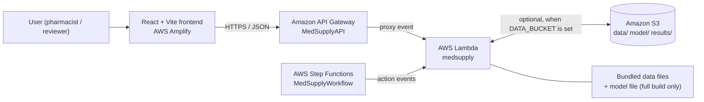
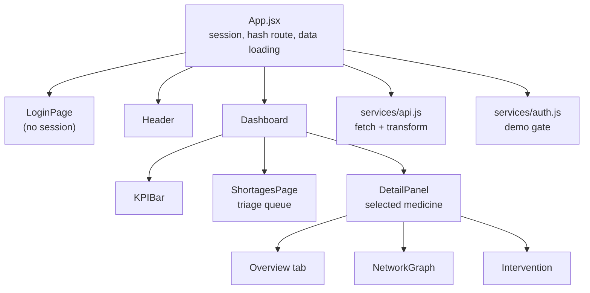
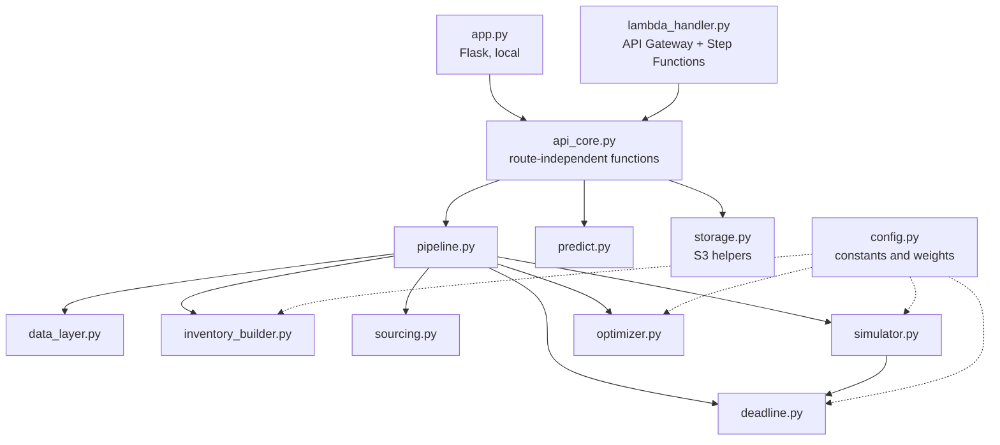
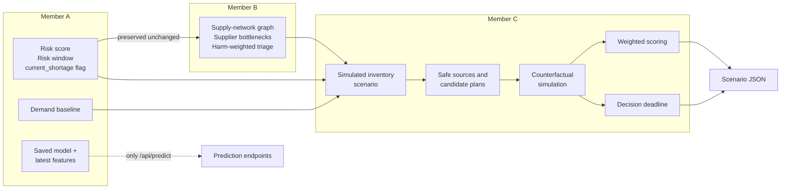
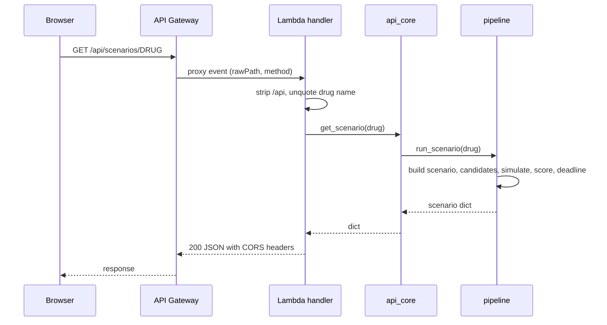
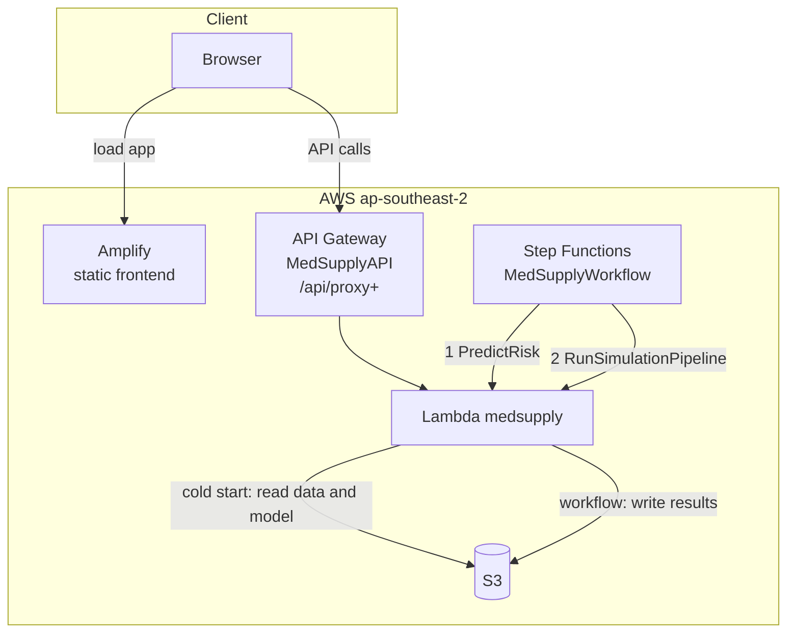
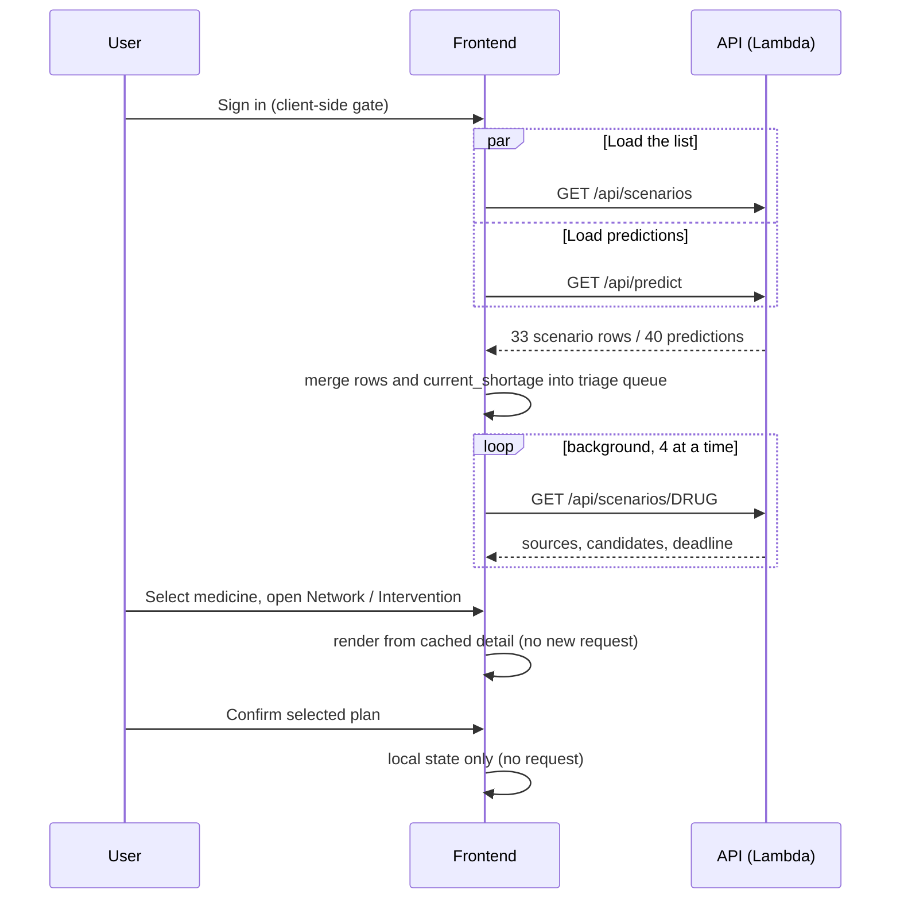
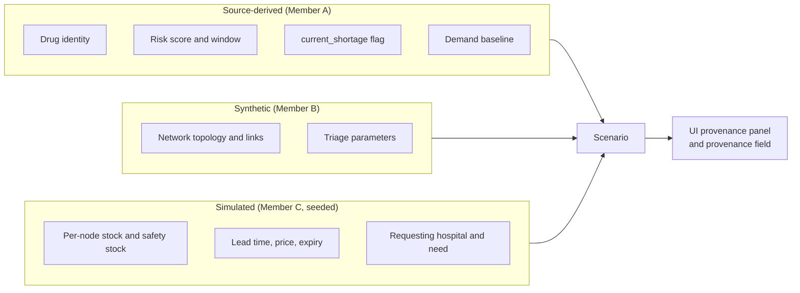

# MedSupply Architecture

This document describes how MedSupply is built and how data moves through it. It is derived from the code in this repository. Facts about the live AWS resources that the repository cannot prove are marked *(per project team)*.

Related: [Root README](../README.md) · [API reference](API.md) · [Deployment](DEPLOYMENT.md) · [Backend README](../backend/README.md) · [Frontend README](../frontend/README.md)

> **Decision support only.** The system compares sourcing options and computes deadlines. It gives no clinical advice, and a human reviews every plan.

---

## 1. System overview

MedSupply has three layers:

1. **A React single-page console** (Amazon Amplify hosting) that shows scenarios and lets a user compare plans.
2. **A stateless Python backend** running as one AWS Lambda function behind Amazon API Gateway. It loads Member A and Member B data, runs Member C's sourcing/simulation pipeline in-process, and returns JSON.
3. **Supporting AWS services:** Amazon S3 (optional input storage and result publishing) and AWS Step Functions (a batch refresh workflow that invokes the same Lambda).

There is no database. Inputs are JSON/CSV files; scenarios are recomputed on request from those files with a fixed random seed, so results are reproducible.

## 2. Frontend architecture

**Stack:** React 18, Vite 5, plain CSS, hash-based routing, hooks for state.

Key design points:

- **One data boundary.** `services/api.js` is the only module that performs requests. It converts backend JSON into the UI's own shape, so components carry no API-specific logic.
- **Two-stage loading.** After sign-in the app loads the scenario list and predictions in parallel, then prefetches the detail of every medicine in the background (4 concurrent requests, highest risk first) so the "days to stockout" column fills in.
- **Selection is in the URL.** `#/drug/<name>/<tab>` identifies the selected medicine and tab.
- **Configurable API base.** `VITE_API_BASE_URL` (build time) with the live API URL as the default.
- **Demo gate.** Sign-in is client-side only and is not a security boundary.

Details: [frontend/README.md](../frontend/README.md).

## 3. Backend architecture

The backend is layered so Flask and Lambda share all logic.

| Layer | Responsibility |
|---|---|
| Entry points | `app.py` (Flask, port 5000, adds CORS `*`) and `lambda_handler.py` (routes `/api/...`, handles `OPTIONS`, and Step Functions `action` events). |
| `api_core.py` | `health`, `list_scenarios`, `get_scenario`, `simulate`, `predict_*`, and the two Step Functions actions. Holds an in-memory cache of the full pipeline run for `GET /api/scenarios`. |
| `pipeline.py` | Loads inputs once, runs one scenario or all scenarios, and runs a custom what-if. |
| `predict.py` | Live model scoring, or the precomputed fallback. |
| `storage.py` | S3 sync on cold start and JSON publish/read; inactive unless `DATA_BUCKET` is set. |

Details: [backend/README.md](../backend/README.md).

## 4. A → B → C processing pipeline

| Stage | Inputs | Outputs |
|---|---|---|
| **A** | FDA/NDC-based dataset (data-prep and training code are not in this repo) | `member_a_output.json`, `latest_features.csv`, `integrated_risk_model.pkl`, `demand_baseline.json` |
| **B** | Member A's output plus a synthetic network | `member_b_output.json`: graph, bottlenecks, triage, cause analysis, candidate substitutions, and Member A's data preserved unchanged |
| **C** | Member B's file (which embeds A's risk values) and the demand baseline | Per-medicine scenario: sources, candidates with verdicts, selected plan, deadline, provenance |

Only some of Member B's output is consumed by Member C (triage rankings, supplier links and bottleneck scores, hospital and warehouse lists). Substitution candidates, common-cause and timing-cascade findings, and the hospital-exposure and warehouse-strain indices are present in the data but not used by the current pipeline, API or UI.

## 5. API flow

Request handling for a typical call:

Error mapping in the Lambda handler: `LookupError` (unknown route) and `KeyError` (unknown drug or missing field) become **404**; `ValueError` and `RuntimeError` become **400**. See [API.md](API.md#error-behavior).

## 6. AWS architecture

| Service | Role in MedSupply |
|---|---|
| **AWS Amplify** | Hosts the built React app at the live URL. |
| **Amazon API Gateway** (`MedSupplyAPI`) | Public HTTPS entry point. Routes `/api/{proxy+}` to Lambda. The handler parses payload-v2 style events (`rawPath`, `requestContext.http.method`). |
| **AWS Lambda** (`medsupply`) | The entire backend: serves API requests and executes Step Functions tasks. The repository templates use the Python 3.12 runtime. |
| **Amazon S3** | When `DATA_BUCKET` is set: source of `data/` and `model/` on cold start, and destination for `results/predictions.json` and `results/member_c_output.json`. Without it, the bundled files are used. |
| **AWS Step Functions** (`MedSupplyWorkflow`) | Batch refresh: `PredictRisk` then `RunSimulationPipeline`, then success. Each state invokes the same Lambda with an `action` payload. |

*Resource names, region (`ap-southeast-2`) and URLs are per the project team.* The repository's SAM templates (`backend/deploy/template-*.yaml`) define equivalent resources under different generated names.

### What each AWS piece does, precisely

- **S3.** Read path: on the first invocation of a Lambda container, `sync_inputs()` downloads `data/` and `model/` into `/tmp`. It redirects the code to those copies only if S3 really contains them (at least 4 data files; at least 1 model file). Write path: only Step Functions actions publish JSON to `results/`.
- **Lambda.** One function, one code path per event type. Events with an `action` key are Step Functions tasks; everything else is treated as an API Gateway request. `OPTIONS` returns 200 for CORS preflight.
- **Step Functions.** Two Lambda tasks with retry (2 attempts, 3 s interval, back-off 2.0) and a catch that routes to a `Fail` state. No schedule is defined in the repository, so executions are started manually. `run_pipeline` also reports `risk_consistency_max_abs_diff`, comparing predictions with the stored Member A scores.
- **API Gateway.** Terminates HTTPS and forwards to Lambda. The repository templates enable CORS for all origins with `GET`, `POST` and `OPTIONS`.
- **Amplify.** Builds and hosts the static frontend; it is separate from the API and only needs the API base URL.

**Important:** the interactive API does **not** read the files Step Functions writes to `results/`. It recomputes responses in-process. The workflow is a refresh/publish path, not a dependency of the UI.

## 7. Frontend → API → backend data flow

`POST /api/simulate` exists in the API and in `api.js`, but no UI component calls it today.

## 8. Data flow between Member A, B and C

| Data item | Produced by | Read by | Path into the response |
|---|---|---|---|
| `risk_score`, `risk_window_days`, `current_shortage` | A | C (via B's `preserved_member_a_data`), `predict.py` | `member_a` block of each scenario; `/api/predict*` |
| Demand level and trend | A (derived) | C `inventory_builder` | Scales simulated stock and forecasts |
| Triage rank, score, priority | B | C `data_layer` | `triage` block; scenario ordering |
| Drug-to-manufacturer links, bottleneck scores | B | C `inventory_builder`, `simulator` | Supplier sources; ripple magnitude |
| Hospital and warehouse lists | B | C `inventory_builder` | Source nodes; requester choice; demand share |
| Stock, lead time, price, expiry | C (simulated) | C | `sources_considered`, candidates, metrics |
| Verdicts, scores, deadline | C | API | `candidates`, `selected_plan_id`, `decision_deadline` |

Member A's values are never modified downstream (a test asserts this for Bupivacaine's risk score).

## 9. Real vs simulated data boundaries

| Boundary | Statement |
|---|---|
| Model outputs are not measurements | The risk model output is *derived* from Member A's dataset. The model code notes its training data is partly synthetic inventory/demand. |
| Topology is synthetic | Manufacturer, warehouse and hospital relationships are generated; manufacturer *names* appear in the graph but the links and capacities are synthetic. |
| Inventory is simulated | No public per-hospital inventory exists. Stock, lead time, price and expiry come from a seeded generator (`SEED = 42`). |
| Seeded decoy | In each scenario one hospital is deliberately built to look attractive but be unsafe, so the rejection demo is partly by construction. |
| Simulation is not ML | The counterfactual simulator is a deterministic day-by-day projection. |
| Scoring is fixed-weight | Weights are hard-coded and disclosed in the output. |

## 10. Design notes and known gaps

- **Reproducible.** Same inputs and seed give the same scenarios. Only the `latest_action_at` and `predicted_stockout_at` timestamps depend on the current time.
- **Graceful degradation.** Missing model or scikit-learn does not break the API: predictions fall back to Member A's stored output, labelled with `source`.
- **Statelessness.** No user data or decisions are stored. Warm Lambda containers cache the full pipeline run in memory.
- **No authentication.** The API is open with CORS `*`; the frontend login only gates the UI.
- **Data-provenance caveat.** With a live-model deployment the `current_shortage` value from `/api/predict` (`risk ≥ 0.37`) differs from Member A's stored flag; see [API.md](API.md#note-on-current_shortage).
