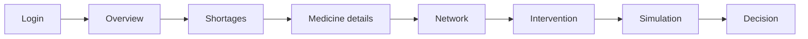

# MedSupply Demo Guide

A practical script for demonstrating MedSupply live or recording the 3-minute demo video. It follows one story with Bupivacaine Hydrochloride Injection as the worked example.

Related: [Root README](../README.md) · [Architecture](ARCHITECTURE.md) · [API reference](API.md) · [Frontend README](../frontend/README.md)

> **Say this early:** MedSupply is decision support. It finds risk, compares options and computes a deadline. A pharmacist makes the final procurement decision, and it gives no clinical advice.

- **Live app:** <https://main.d31fsbjqraajfj.amplifyapp.com>
- **API base:** `https://ir06s4arb0.execute-api.ap-southeast-2.amazonaws.com`

## The idea to get across

The differentiator is not only *predicting* a shortage. It is that MedSupply **tests each possible response against the whole supply network before recommending it**:

1. Identify shortage risk
2. Understand the affected supply network
3. Identify candidate responses
4. Simulate each intervention
5. Reject unsafe options
6. Retain safe options
7. Compare outcomes
8. Support a final **human** procurement decision

## Story at a glance



| # | Step | Where in the UI | Time (3-min cut) |
|---|---|---|---|
| 1 | Login | Sign-in page | 0:10 |
| 2 | Overview | KPI strip and header | 0:15 |
| 3 | Shortages | Triage queue | 0:20 |
| 4 | Medicine details | **Overview** tab of the selected medicine | 0:30 |
| 5 | Network | **Network** tab | 0:25 |
| 6 | Intervention | **Intervention** tab | 0:45 |
| 7 | Simulation | Rejected/ruled-out plans, accepted options, and network impact shown in the Intervention tab | 0:20 |
| 8 | Decision | Confirm bar | 0:15 |

The UI is one dashboard page with three tabs, so "Overview" is the KPI strip plus the first tab; there is no separate Overview page.

## Before you start

- [ ] Open the live app once beforehand. The first API call can be slow after idle (Lambda cold start). After sign-in the app prefetches every medicine's detail in the background; wait until the "days to stockout" column stops showing `…`.
- [ ] Check which prediction mode the API is in:
  ```bash
  curl https://ir06s4arb0.execute-api.ap-southeast-2.amazonaws.com/api/health
  ```
  In the lite deployment, `model.live_model_available` is `false` and predictions come from Member A's precomputed output.
- [ ] The numbers below assume that lite/precomputed mode. With a live-model backend, the "Active shortages" KPI counts differently (see [API.md](API.md#note-on-current_shortage)).
- [ ] Have `curl` or an API client ready if you want the optional live simulation call in step 7.
- [ ] Figures are **deterministic** (fixed random seed). Only clocks and the deadline countdown change between runs.

## Walkthrough

### 1. Login

Open the app. The sign-in page shows the demo account and a **Fill in for me** button; click it, then **Sign in**.

*Say:* "This is a demo gate for the console. The pharmacist makes the final decision, and the system only finds which medicines are heading for a stockout and which responses are safe."

*Note:* the login is client-side only. It is not security.

### 2. Overview

Point at the header (decision horizon 14 days) and the four KPI tiles. With the current data in lite mode:

| Tile | Value |
|---|---|
| Active shortages | 8 |
| Need action today | 2 |
| Under watch | 6 |
| Safe response plans | 121 |

*Say:* "33 medicines are at risk. The system evaluated 165 candidate response plans across them and found at least one safe plan for every one, while rejecting 43 as unsafe." Then point at the footer: FDA status and risk are source-derived, inventory and pricing are simulated, topology is synthetic.

*Note:* "Pipeline online" in the header is a static label, not a live health check.

### 3. Shortages (triage queue)

The left column lists medicines ranked by risk. Bupivacaine is first at **88.76%**, followed by Cefepime (88.35%) and Carboplatin (80.65%).

Show the tools: search ("bupi"), then click the **Need action today** tile or chip. It filters to the 2 medicines that are active shortages with an urgent deadline (Bupivacaine and Carboplatin). Click **Bupivacaine** and clear the filter.

*Say:* "Priority comes from Member B's harm-weighted triage; the colored risk band is just a visual treatment."

### 4. Medicine details

Stay on the **Overview** tab for Bupivacaine and walk down the panel:

| Element | What it shows |
|---|---|
| Action banner | Predicted to run out in **3.83 days**; "respond within **20 hours**"; **4** safe response options available |
| Risk spotlight | 88.76%, warning window **7 days**, FDA status **CURRENT**, priority **Critical** |
| Decision timeline | NOW → ACTION DEADLINE (live countdown) → PREDICTED STOCKOUT |
| If nothing changes | 3.83 days to stockout, **856** unmet units, 1 affected facility (St. Jude Regional Medical Center) |
| Alert evidence | 67.13 units/day with 257 units on hand; projected stockout in 3.83 days |
| Data provenance | Real / real-derived vs Simulated vs Synthetic |

*Say:* "The deadline is the predicted stockout minus lead time minus one day for approval. Here the best plan needs 2 days to arrive plus 1 to approve, against 3.83 days of stock, so the latest action is in 0.83 days. Status: ACT NOW."

*Note:* the hospital and its stock are simulated.

### 5. Network

Open the **Network** tab. The medicine sits at the top with **2 suppliers** (Pfizer, Fresenius Kabi), **3 warehouses** and **4 hospitals** grouped beneath it. The requesting hospital has a dashed red ring.

Click two facilities to show *why* some sources are not safe:

- **McKesson National Distribution Center:** "At risk", low transferable stock. The drawer explains: stock 1584 − safety 408 − forecast demand 1655 = −479. Nothing safe to give.
- **Apex Health System:** only 68 units are safely transferable, despite 941 in stock.
- **Cencora Regional Hub:** "Can supply", 1,228 units safely transferable.

*Say:* "A source is only safe if it can give stock without going below its own safety level given forecast demand."

*Note:* this is a star layout of the scenario's sources, not Member B's full graph. Do not describe it as the complete network.

### 6. Intervention

Open the **Intervention** tab. Five candidate plans were evaluated for Bupivacaine: 1 rejected, 4 accepted.

Start with the side-by-side comparison at the top.

| | **Rejected by simulation** | **Safe option (recommended)** |
|---|---|---|
| Plan | Cheapest first | Largest stock first |
| Source | Valley Children's Hospital | Cencora Regional Hub |
| Quantity | 856 units | 856 units |
| Lead time | 1 day | 2 days |
| Cost | ₹24,603.20 | ₹45,922.08 |
| Why | Source would drop to −502 units: *"Creates NEW shortage at Valley Children's Hospital"* | Simulation creates no new shortage; future network risk 0.4182 (Low) |

*Say:* "The cheapest and fastest-looking plan would fix one hospital by creating a shortage at another. The simulation catches it. A tool that only looks at price or speed would recommend it."

Then show the other safe options in **Compare** (cards) or **Ranked list** view, and try the sort menu:

| Plan | Cost | Lead | Network risk | Note |
|---|---|---|---|---|
| Largest stock first (**recommended**) | ₹45,922.08 | 2 d | 0.4182 | Lowest weighted score in the API (`score` 0.1938; not shown in the UI) |
| Lowest cost | ₹40,637.87 | 2 d | 0.6000 (Medium) | Cheaper, but uses up all the safe headroom at several sources |
| Fastest delivery | ₹40,637.87 | 1 d | 0.6000 (Medium) | Arrives sooner |
| Balanced across sources | ₹50,580.12 | 5 d | 0.4951 | Marked **"Safe, but late"** in the list: its slowest part arrives after the deadline |

*Say:* "Only plans that passed simulation are ranked. Because the deadline is close, the ranking weights lead time most heavily. The weights are fixed and disclosed."

### 7. Simulation

Two things to show.

**In the UI**

1. Expand **Plans the simulation ruled out** and read the reason.
2. Select **Balanced across sources** and scroll to **Network impact of the selected option**: it draws on Pfizer and Fresenius Kabi, and the simulation shows **18** other medicines from that manufacturer with an average risk increase of about **+2.64%** and **0** newly at risk. Expand **Show affected drugs** for per-medicine before/after risk.

*Say:* "Simulation also looks sideways: taking stock from a manufacturer can raise risk for its other medicines."

**Optional: a custom what-if via the API.** The UI does **not** call `POST /api/simulate`, so run this separately and be explicit about it.

```bash
BASE=https://ir06s4arb0.execute-api.ap-southeast-2.amazonaws.com
curl -X POST "$BASE/api/simulate" -H "Content-Type: application/json" \
  -d '{"drug":"BUPIVACAINE HYDROCHLORIDE INJECTION",
       "allocations":[{"source_id":"HOSP_APEX_HEALTH","units":800}]}'
```

Expected: `"verdict": "REJECTED"` with reasons *"Creates NEW shortage at Apex Health System (Hospital)"* and *"Only covers 94% of the 856 units needed"*. Then propose the safe alternative:

```bash
curl -X POST "$BASE/api/simulate" -H "Content-Type: application/json" \
  -d '{"drug":"BUPIVACAINE HYDROCHLORIDE INJECTION",
       "allocations":[{"source_id":"WH_CENCORA_REG","units":856}]}'
```

Expected: `"verdict": "ACCEPTED"`.

### 8. Decision

At the bottom of the Intervention tab, the confirm bar shows the selected plan (source, cost, lead time). Click **Confirm selected plan →**.

*Say:* "The console confirms a selection for the pharmacist. Nothing is ordered automatically, and the procurement decision stays with the team."

*Be accurate:* the confirmation is on-screen state only. Nothing is saved or sent to a backend, even though the banner says the plan is "recorded for pharmacist sign-off". Do not claim an audit trail exists.

## Closing line

"MedSupply doesn't just say a shortage is coming. It shows who is affected, tests every response against the network, throws out the ones that would cause a second shortage, and tells a pharmacist how long they have to decide."

## What not to claim

| Do not say | Because |
|---|---|
| "Real hospital inventory" | Stock, lead times, prices and expiry are simulated; topology is synthetic |
| "The unsafe plan was found by AI" | One hospital per scenario is a seeded decoy, and the simulator is a deterministic projection, not machine learning |
| "Optimized" (in the mathematical sense) | Scoring is a fixed-weight heuristic over a small set of candidates |
| "Clinically validated" or any substitution advice | Decision support only; substitution links in the data are non-clinical and not shown in the UI |
| "The prediction what-if is a simulation" | `POST /api/predict` with `overrides` is an experimental sensitivity probe, not causal |
| "The decision is saved" | The confirm step is UI-only |
| "Production-ready" | No authentication, demo login, open CORS |
| "The model runs live in production" | The lite deployment serves Member A's precomputed output; check `/api/health` |

## If something goes wrong

| Problem | What to do |
|---|---|
| "Couldn't load the shortage list" | The API may be cold or unreachable. Click **Try again**; check `/api/health`. |
| Days column stays `…` | Detail prefetch is still running (33 requests); wait a few seconds. |
| KPI numbers differ from the table above | The API may be in live-model mode (different `current_shortage`), or the data changed. Check `/api/health` and `/api/predict`. |
| A medicine shows a "summary only" banner | Its detail request failed; go back and reopen it. |
| Numbers differ slightly from `demoData.js` | That file holds offline fixtures with placeholder values; quote live data only. |
