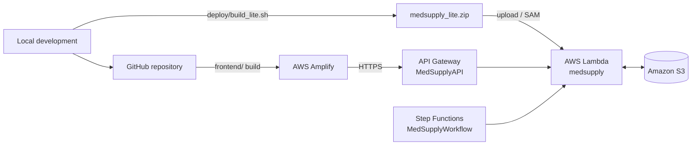
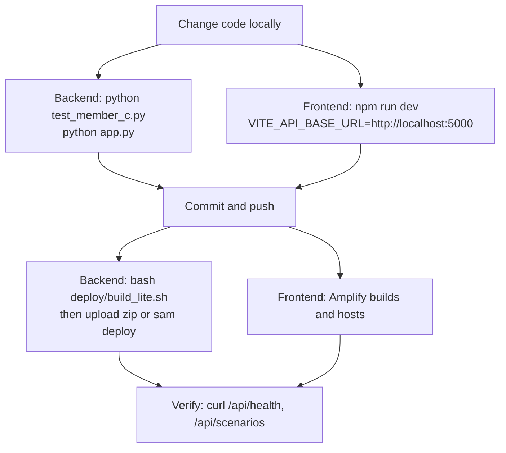

# MedSupply Deployment

How MedSupply is deployed on AWS, what in the repository supports each step, and how a local change reaches production.

Related: [Root README](../README.md) · [Architecture](ARCHITECTURE.md) · [API reference](API.md) · [Backend README](../backend/README.md) · [Frontend README](../frontend/README.md)

> **What is verified here.** Package layout, handler, templates, state machine and build behavior come from the repository (and the lite build was run for this documentation). The live resource names, region and URLs are **per the project team** and cannot be confirmed from the repository. They are marked *(per team)*.

---

## 1. Current deployment

| Component | Value |
|---|---|
| AWS region | `ap-southeast-2` *(per team)* |
| Frontend | AWS Amplify, <https://main.d31fsbjqraajjf.amplifyapp.com> *(per team)* |
| API | Amazon API Gateway `MedSupplyAPI`, base URL `https://ir06s4arb0.execute-api.ap-southeast-2.amazonaws.com` *(per team)* |
| Backend compute | AWS Lambda function `medsupply` *(per team)*, lite package |
| Workflow | AWS Step Functions state machine `MedSupplyWorkflow` *(per team)* |
| Storage | Amazon S3 bucket; inputs and published results, used when `DATA_BUCKET` is set. Bucket name is not stored in the repository. |
| Source repository | <https://github.com/DHIKSHITHA0906/MedSupply> |

The frontend and backend are deployed independently. The frontend is static files that call the API over HTTPS.



## 2. Backend deployment structure

The whole backend is **one Lambda function** that serves API Gateway requests and Step Functions tasks.

| Setting | Value | Source |
|---|---|---|
| Handler | `lambda_handler.lambda_handler` | `template-*.yaml`, `Dockerfile`, `DEPLOY.md` |
| Runtime | Python 3.12 | `template-lite.yaml`, `Dockerfile` |
| Memory / timeout (lite) | 128 MB / 30 s (current deployed) | `template-lite.yaml` defines 512 MB / 30 s |
| Memory / timeout (full) | 2048 MB / 30 s | `template-full.yaml` |
| API route | `/api/{proxy+}`, method `ANY` | `template-*.yaml` |
| CORS | Origins `*`; header `Content-Type`; methods `GET, POST, OPTIONS` | `template-*.yaml`; the handler also adds CORS headers to every response |

The template defines 512 MB / 30 s for the lite variant. The currently deployed `medsupply` Lambda uses 128 MB / 30 s.

### Package layout

`lambda_handler.py` must be at the **top level** of the package:

```text
lambda_handler.py
medsupply_member_c/     # the backend package
data/                   # member_a_output.json, member_b_output.json,
                        # demand_baseline.json, latest_features.csv
```

The **full** variant additionally bundles `model/integrated_risk_model.pkl` and installs scikit-learn.

## 3. Lite vs full

| | **Lite** (current) | **Full** |
|---|---|---|
| Package | Zip: code + data | Container image (`deploy/Dockerfile`) |
| Model file and scikit-learn | **Not included** | Included (`scikit-learn==1.8.0`, plus numpy, scipy, joblib) |
| Prediction `source` | `precomputed_member_a_output` | `live_model` |
| `POST /api/predict` with `overrides` | 400 (needs live model) | Works (experimental) |
| Size / memory | ≈ 38 KB zip; 512 MB | Large image; 2048 MB; slower cold start (`DEPLOY.md` estimates 10 to 20 s) |
| Scenario endpoints | Identical | Identical |

Scenario, simulation and deadline endpoints do not use the model, so they behave the same in both variants. To confirm which variant a deployment is running:

```bash
curl "$BASE/api/health"      # model.live_model_available: false => lite fallback
```

## 4. The lite package and `build_lite/`

```bash
cd backend
bash deploy/build_lite.sh
```

The script:

1. `cd`s to `backend/`;
2. deletes any existing `build_lite/` and `medsupply_lite.zip`;
3. creates `build_lite/` and copies in `medsupply_member_c/`, `data/` and `lambda_handler.py`;
4. removes `__pycache__` directories;
5. zips the contents (from inside `build_lite/`) into `medsupply_lite.zip`.

**Generated output is not committed.** `.gitignore` excludes `backend/build_lite/` and `*.zip`, so both are recreated by every run. SAM's `template-lite.yaml` uses `CodeUri: ../build_lite/`, so you must run the build script **before** `sam build` / `sam deploy`.

Verified for this documentation: a build produced a ≈ 38 KB zip with `lambda_handler.py` at the top level and **no** model file or scikit-learn. The handler then served all routes; `/api/predict*` returned `"source": "precomputed_member_a_output"`, `POST /api/simulate` still worked, and `POST /api/predict` with `overrides` returned 400.

> **Line endings.** The repository snapshot has Windows (CRLF) line endings, and `build_lite.sh` then fails on Linux, macOS, WSL or Git Bash with `$'\r': command not found`. Fix with `sed -i 's/\r$//' deploy/build_lite.sh` (or `dos2unix`). Adding a `.gitattributes` rule such as `*.sh text eol=lf` would prevent it.

> **`backend/medsupply_lite/`** is a committed copy of the lite package contents (handler, `medsupply_member_c/`, `data/`). It is currently identical to the top-level sources, but nothing generates or references it, so it can drift. Build from the top-level sources.

## 5. What `backend/deploy/` contains

| File | Purpose |
|---|---|
| `build_lite.sh` | Builds `build_lite/` and `medsupply_lite.zip` (see above) |
| `requirements-lite.txt` | Comment only: the lite Lambda needs no extra packages (`boto3` is already in the Lambda runtime) |
| `template-lite.yaml` | SAM/CloudFormation: S3 bucket, HTTP API (`/api/{proxy+}`), Python 3.12 function from `../build_lite/`, Standard state machine; outputs `ApiUrl`, `BucketName`, `StateMachineArn` |
| `template-full.yaml` | Same resources, but the function is a container image (`Dockerfile`), 2048 MB |
| `Dockerfile` | Lambda Python 3.12 base image; installs numpy, scipy, joblib, `scikit-learn==1.8.0`; copies code, `data/`, `model/` |
| `state_machine.asl.json` | Step Functions definition with a `${FunctionArn}` placeholder |
| `DEPLOY.md` | The original deployment walkthrough. **Partly outdated** (see below) |

### Step Functions definition

`PredictRisk` (invokes the Lambda with `{"action": "predict_all"}`) → `RunSimulationPipeline` (`{"action": "run_pipeline"}`) → `Done`. Each task retries twice (3 s interval, back-off 2.0) and any error goes to a `Fail` state named `MedSupplyPipelineFailed`. `${FunctionArn}` appears in two places. The definition's comment says "nightly refresh", but **no schedule is defined in the repository**; executions are started manually. Results are published to S3 (`results/predictions.json`, `results/member_c_output.json`) only if `DATA_BUCKET` is set. The interactive API does not read them.

### About `DEPLOY.md`

`DEPLOY.md` is the earlier hand-written guide. Its three paths (console zip, SAM lite, SAM full) are still a reasonable reference, but it predates the final architecture:

- Path 1 exposes the function through a **Lambda Function URL**; the current deployment uses **API Gateway**.
- It uses the function name `medsupply-c` and refers to "Member D's frontend"; the deployed function is `medsupply`.
- It states the author did **not** test a real AWS deploy.
- It suggests `AmazonS3FullAccess` "for a hackathon"; prefer a policy scoped to the bucket (the SAM templates use `S3CrudPolicy` on the bucket).

## 6. Deployment flow

The repository supports these ways to deploy the backend. The resources in section 1 correspond to the same building blocks.

### Option A: console upload (no CLI)
> These are the repository-supported deployment options; the current project deployment was configured through the AWS console using Lambda + API Gateway + S3 + Step Functions.

1. Build the zip (`bash deploy/build_lite.sh`).
2. In Lambda, create a Python 3.12 function and upload `medsupply_lite.zip`; set the handler to `lambda_handler.lambda_handler`, memory 512 MB, timeout 30 s.
3. Put the function behind API Gateway with the route `/api/{proxy+}` and CORS for `Content-Type` (`GET`, `POST`, `OPTIONS`).
4. *(Optional)* Create an S3 bucket, upload the four `data/` files under the prefix `data/`, set the Lambda environment variable `DATA_BUCKET`, and grant the function's role read/write on that bucket. If S3 lacks the data files, the function silently uses the copies bundled in the zip.
5. *(Optional)* Create a Standard state machine from `state_machine.asl.json`, replacing both `${FunctionArn}` placeholders with the Lambda ARN; allow it to invoke the function. Start an execution with input `{}`.

### Option B: SAM, lite

```bash
cd backend
bash deploy/build_lite.sh
sam deploy -t deploy/template-lite.yaml --guided --resolve-s3
# If packaging complains:  sam build -t deploy/template-lite.yaml  then  sam deploy --guided
```

Outputs: `ApiUrl` (already ends in `/api`, so call `<ApiUrl>/health`), `BucketName`, `StateMachineArn`. Optionally `aws s3 sync data/ s3://<BucketName>/data/`. Start the workflow with `aws stepfunctions start-execution --state-machine-arn <StateMachineArn> --input "{}"`. This stack creates its own generated resource names, not `medsupply` / `MedSupplyAPI` / `MedSupplyWorkflow`.

### Option C: SAM, full (live model)

Requires Docker and the SAM CLI.

```bash
cd backend
sam build -t deploy/template-full.yaml
sam deploy --guided --resolve-image-repos --resolve-s3
```

Then `GET <ApiUrl>/predict/<drug>` reports `"source": "live_model"`. Upload `model/` to S3 only if you want S3 to be the source of truth for the model.

## 7. Environment variables

**Backend (Lambda)**

| Variable | Set by | Effect |
|---|---|---|
| `DATA_BUCKET` | You (Lambda config / SAM) | Enables S3: cold-start download of `data/` and `model/` into `/tmp/medsupply`, and result publishing by Step Functions. Unset means no S3 access at all (local runs need no AWS). |
| `MEDSUPPLY_DATA_DIR` | Code (`storage.sync_inputs`) | Redirected to the downloaded data only if ≥ 4 data files were fetched from S3 |
| `MEDSUPPLY_MODEL_PATH` | Code (`storage.sync_inputs`) | Redirected to the downloaded model only if ≥ 1 model file was fetched |

`MEDSUPPLY_DATA_DIR` and `MEDSUPPLY_MODEL_PATH` may also be set manually to point at other locations. No secrets are required; AWS access uses the function's IAM role.

**Frontend (build time, Vite)**

| Variable | Effect |
|---|---|
| `VITE_API_BASE_URL` | API root, no trailing slash and no `/api`. Defaults to the live API URL if unset. |
| `VITE_DEMO_USER`, `VITE_DEMO_PASS` | Optional overrides of the demo sign-in. Inlined into the browser bundle, so **not secret**. |

## 8. Frontend deployment (Amplify)

- Hosted on AWS Amplify at <https://main.d31fsbjqraajjf.amplifyapp.com> *(per team)*.
- The repository has **no `amplify.yml`**; build settings live in the Amplify console. The layout implies: app root `frontend/`, install with `npm ci`, build with `npm run build`, publish `dist/`. Confirm the actual settings in the console.
- Routing is hash-based, so no rewrite rules are needed.
- The API base defaults to the live API. Set `VITE_API_BASE_URL` in Amplify only to point at a different API.
- The API allows any origin, so no frontend-side CORS setup is needed.

## 9. Local-to-production workflow



1. Develop and test locally (see the [backend](../backend/README.md#run-locally) and [frontend](../frontend/README.md#local-development) READMEs).
2. Push to GitHub. The frontend is rebuilt and hosted by Amplify.
3. For backend changes, rebuild the lite package and update the Lambda. Pushing to GitHub alone does not update the Lambda; the repository contains no CI/CD pipeline for the backend.
4. Verify against the deployed API.

## 10. Verifying a deployment

```bash
BASE=https://ir06s4arb0.execute-api.ap-southeast-2.amazonaws.com

curl "$BASE/api/health"                       # status ok; check model.live_model_available
curl "$BASE/api/scenarios"                    # summary.scenarios should be 33
curl "$BASE/api/predict/CARBOPLATIN%20INJECTION"   # source shows lite vs live; risk_score 0.8065
curl -X POST "$BASE/api/simulate" -H "Content-Type: application/json" \
  -d '{"drug":"BUPIVACAINE HYDROCHLORIDE INJECTION","allocations":[{"source_id":"HOSP_APEX_HEALTH","units":800}]}'
                                               # verdict must be REJECTED
```

## 11. Troubleshooting

| Symptom | Likely cause |
|---|---|
| `Runtime.ImportModuleError` / 500 | Handler must be exactly `lambda_handler.lambda_handler`, and `lambda_handler.py` must be at the zip's top level. Rebuild with `build_lite.sh`. |
| `{"message":"Not Found"}` from API Gateway | Use `/api/...` paths; the route is `/api/{proxy+}`. |
| Browser CORS error | API CORS must allow the request origin and the `Content-Type` header. |
| `AccessDenied` on S3 | The function's role lacks access to the bucket. |
| Timeout on first call | Cold start; raise the timeout to 30 s and, if needed, memory to 1024 MB. |
| Prediction `source` is `precomputed_member_a_output` | Expected in the lite package. Deploy the full variant for `live_model`. |
| `build_lite.sh`: `$'\r': command not found` | CRLF line endings; see section 4. |
| Full image build fails on Windows | Use WSL, or stay on the lite package. |

## 12. Security, cost and limitations

- The API has **no authentication** and CORS allows any origin. Do not put real data behind it.
- `/api/health` returns the raw model-load error, which may include file paths.
- The frontend login is client-side only.
- Small usage is normally within the AWS free tier, but check your account. To remove SAM stacks use `sam delete`; otherwise delete the Lambda, API, bucket and state machine in the console.
- No backend CI/CD, monitoring or alarms are defined in the repository.
- This is a demonstration deployment, not a production-ready one.
