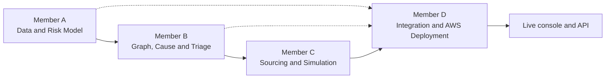

# MedSupply Team

MedSupply was built by four contributors, each owning one stage of the pipeline or the system around it. This document records their roles as stated by the team.

Related: [Root README](../README.md) · [Architecture](ARCHITECTURE.md) · [Backend README](../backend/README.md) · [Demo guide](DEMO.md)

## Overview

| Member | Contributor | Role |
|---|---|---|
| A | **KatirVelavan** | Data & Risk Model |
| B | **R. Shreya** | Graph, Cause & Triage |
| C | **Akshaya M V** | Sourcing & Simulation |
| D | **DHIKSHITHA R G** | System Integration & AWS Deployment |

---

## KatirVelavan: Member A, Data & Risk Model

**Focus:** turning source data into shortage-risk signals.

- FDA/NDC data preparation
- Risk prediction (risk score per medicine)
- Risk window (time horizon attached to each risk)
- Shortage handling (current-shortage status)
- Substitution and cascade work
- Started the frontend (initial development)
- Responsible for the 3-minute demo video

**In the repository:** `backend/data/member_a_output.json`, `backend/data/latest_features.csv`, `backend/model/integrated_risk_model.pkl`, and the demand baseline in `backend/data/demand_baseline.json`, which is derived from Member A's training data. The data-preparation and training code is not part of this repository.

## R. Shreya: Member B, Graph, Cause & Triage

**Focus:** modelling the supply network and deciding what to look at first.

- Supply-network graph (medicines, manufacturers, warehouses, hospitals)
- Hospital, warehouse and manufacturer relationships
- Risk propagation
- Bottleneck analysis
- Common-cause and cascade analysis
- Harm-weighted triage and alert prioritization
- Responsible for the final project report

**In the repository:** `backend/data/member_b_output.json`, which contains the graph, supplier bottlenecks, triage rankings, cause analysis, candidate substitutions, and Member A's data preserved unchanged. The current pipeline and UI use the triage rankings, supplier links, bottleneck scores, and hospital and warehouse lists.

## Akshaya M V: Member C, Sourcing & Simulation

**Focus:** turning a risk warning into safe, comparable, time-bound response options.

- Safe-source discovery
- Candidate generation
- Counterfactual simulation
- Network-impact evaluation
- Weighted candidate scoring
- Decision-deadline calculation
- Frontend refinement

**In the repository:** the pipeline modules in `backend/medsupply_member_c/` (`inventory_builder.py`, `sourcing.py`, `simulator.py`, `optimizer.py`, `deadline.py`, `pipeline.py`, `config.py`), `backend/test_member_c.py`, and the generated `backend/member_c_output.json`.

## DHIKSHITHA R G: Member D, System Integration & AWS Deployment

**Focus:** connecting the stages and putting them online.

- A → B → C integration
- AWS deployment: AWS Lambda, Amazon S3, AWS Step Functions, Amazon API Gateway
- API testing
- Live frontend/backend integration
- AWS Amplify deployment
- GitHub cleanup
- Complete project documentation

**In the repository:** the deployment assets in `backend/deploy/`, the Lambda entry point `backend/lambda_handler.py`, the frontend's API layer `frontend/src/services/api.js`, and the documentation in `README.md`, `backend/README.md`, `frontend/README.md` and `docs/`.

---

## Frontend contributions

The frontend involved three people in sequence:

| Stage | Contributor |
|---|---|
| Initial development | KatirVelavan (Member A) |
| Refinement | Akshaya M V (Member C) |
| Live API integration and Amplify deployment | DHIKSHITHA R G (Member D) |

## Project deliverables

| Deliverable | Owner |
|---|---|
| 3-minute demo video | KatirVelavan (Member A) |
| Final project report | R. Shreya (Member B) |
| Deployed API and frontend | DHIKSHITHA R G (Member D) |
| GitHub documentation | DHIKSHITHA R G (Member D) |

The demo video and the final report are not stored in this repository. For a walkthrough of the working system, see the [demo guide](DEMO.md).

## A note on attribution

Roles above are as reported by the team. The repository snapshot used for this documentation has **no commit history**, so the "In the repository" mappings are based on file and module names, not on per-commit authorship. Some code comments use the historical labels "Member C" (for the shared `medsupply_member_c` package, which also holds the API layer) and "for Member D" (for the local API in `app.py`); these are naming conventions from earlier stages, not a different division of responsibilities.
